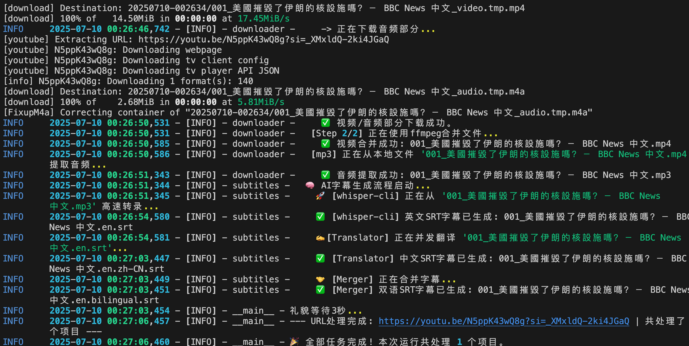

#  🚀 SmartDownloader

[](https://github.com/Jesencloud/SmartDownloader/stargazers)
[](https://github.com/Jesencloud/SmartDownloader/issues)

🔍 **简短描述**：
> ✉️一个基于 yt-dlp 和 whisper.cpp 的智能媒体下载与AI字幕生成工具，可自动完成视频下载、语音转录、翻译及双语字幕制作。

> ✉️An intelligent media downloader and AI subtitle generation tool based on yt-dlp and whisper.cpp. It automates video downloading, speech-to-text transcription, translation, and bilingual subtitle creation.

---
## 📌 目录
### ⚙️功能特性
这是一个功能强大的自动化媒体处理脚本。它使用 `yt-dlp` 作为下载核心，支持从URL或文件批量下载视频（MP4）和音频（MP3）。

其核心亮点是集成了基于 `whisper.cpp` 的高性能AI字幕生成流程。当下载的视频缺少字幕时，它能够：
1.  **自动进行语音识别**，利用Apple Silicon的Metal硬件加速生成高精度英文字幕。
2.  调用翻译服务将英文字幕**翻译为简体中文**。
3.  最终生成**英文、中文、中英双语**共三种格式的`.srt`字幕文件。

整个流程完全自动化，并支持通过代理进行网络访问，是一个高效的、一站式的视频获取与本地化工具。

---

* 🎥🎵**多模式媒体下载**:
    * `--mode video`: 仅下载视频文件 (默认)。
    * `--mode both`: 同时下载视频文件 (`.mp4`) 和一个独立的音频文件 (`.mp3`)。

* 🤖**强大的AI字幕流水线** (`--ai-subs`):
    * **自动触发**: 仅在视频没有自带字幕时启动。
    * **硬件加速转录**: 调用 `whisper.cpp`，充分利用Apple Silicon的GPU和神经网络引擎(ANE)进行高速语音识别。
    * **自动翻译**: 将生成的英文字幕翻译为简体中文。
    * **多格式输出**: 自动生成独立的 `.en.srt` (英), `.zh-CN.srt` (中), 和 `.bilingual.srt` (双语) 文件。

* 🚀**高效与性能**:
    * **并发翻译**: 使用线程池并行处理翻译请求，大幅缩短等待时间。
    * **流式处理**: 解析播放列表时无需等待，可立即开始处理第一个项目。
    * **本地提取**: 在`both`模式下，MP3从已下载的视频文件在本地提取，避免重复下载。

* 🛜**灵活的输入与网络**:
    * 支持处理单个或多个URL。
    * 支持通过文件 (`-b`) 进行批量处理。
    * 支持全局网络代理 (`-p`)，可应用于下载和翻译。
    * 支持使用`cookies.txt`进行认证。

* 📁**完善的文件管理**:
    * 每次运行自动创建独立的时间戳文件夹。
    * 自动清理和截短过长的文件名。
    * 为每个视频生成包含标题、ID、作者等信息的 `.txt` 文档。
    * 任务结束后自动清理所有临时文件。

---


###  📦 安装指南
>这份指南将涵盖运行我们最终版的三个脚本（`main.py`, `downloader.py`, `subtitles.py`）所需的所有外部依赖，包括Python库、命令行工具和AI模型文件。

>#### 🍎💻**智能媒体下载与AI字幕工具：完整环境配置指南 (macOS)**

本文档旨在指导您完成运行本工具所需的全部环境配置。请按顺序执行以下步骤。

##### **1. 基础环境**

  * **Python**: 请确保您的系统中已安装 Python 3.9 或更高版本。您可以在终端中运行 `python3 --version` 来检查。
  * **Homebrew**: 这是macOS上最推荐的包管理器，我们将用它来安装核心的命令行工具。如果您尚未安装，请在终端中运行以下命令进行安装：
    ```bash
    /bin/bash -c "$(curl -fsSL https://raw.githubusercontent.com/Homebrew/install/HEAD/install.sh)"
    ```

-----

##### **2. Python 库依赖 (通过 `pip` 安装)**

我们项目的所有Python库依赖都记录在 `requirements.txt` 文件中，可以一键安装。

1.  在您的 `SmartDownloader` 项目文件夹中，创建一个名为 `requirements.txt` 的新文件。
2.  将以下内容复制并粘贴到 `requirements.txt` 文件中：
    ```txt
    # 核心下载器
    yt-dlp

    # AI 语音识别库 (即使我们主要用命令行，也建议安装以避免导入问题)
    openai-whisper

    # 字幕翻译库
    deep-translator
    ```
3.  打开终端，`cd` 进入您的 `SmartDownloader` 文件夹，然后运行以下命令来安装所有库：
    ```bash
    pip install -r requirements.txt
    ```

-----

##### **3. 外部命令行工具 (通过 `Homebrew` 安装)**

我们的脚本依赖两个非常重要的外部工具：`ffmpeg` 和 `whisper.cpp`。

1.  **安装 FFmpeg (多媒体处理核心)**

      * **作用**: 用于合并视频/音频流、从视频中提取MP3等。
      * **安装命令**:
        ```bash
        brew install ffmpeg
        ```
      * **验证**: 运行 `ffmpeg -version`，如果成功显示版本信息，则表示安装成功。

2.  **安装 Whisper.cpp (高性能语音识别引擎)**

      * **作用**: 利用您的M系列芯片进行硬件加速的语音转录。
      * **安装命令**:
        ```bash
        brew install whisper-cpp
        ```
      * **验证**: 运行 `whisper-cli --version`，如果成功显示版本信息，则表示安装成功。

-----

##### **4. AI 模型文件 (手动下载)**

`whisper-cli` 需要一个预先训练好的模型文件才能工作。我们需要手动下载它并放到指定位置。

1.  **创建存放模型的文件夹** (如果不存在的话):

    ```bash
    mkdir -p ~/.cache/whisper/whisper.cpp
    ```

2.  **进入该文件夹**:

    ```bash
    cd ~/.cache/whisper/whisper.cpp
    ```

3.  **使用 `curl` 下载模型文件** (大小约 142MB):

    ```bash
    curl -L -o ggml-base.en.bin https://huggingface.co/ggerganov/whisper.cpp/resolve/main/ggml-base.en.bin
    ```

    这一步完成后，AI转录功能所需的所有条件就都准备好了。

-----

>#### ✅**5. 环境配置核对清单**

 在运行主脚本前，请最后确认一遍：

>  * [ ] Python 3.9+ 已安装。
> * [ ] `requirements.txt` 中的所有Python库已通过`pip`成功安装。
>  * [ ] `ffmpeg` 命令已通过`brew`成功安装，在终端中可直接运行。
>  * [ ] `whisper-cpp` 命令已通过`brew`成功安装，`whisper-cli`命令可用。
>  * [ ] `ggml-base.en.bin` 模型文件已下载到 `~/.cache/whisper/whisper.cpp/` 目录下。

完成以上所有步骤后，您的系统环境就完全准备就绪了，可以顺利地运行我们功能完备的 `main.py` 脚本了。

----
### 🔛快速开始

>#### **使用示例：批量下载视频和音频，并自动生成AI字幕（通过代理）**

这个例子将演示如何使用一个文本文件作为输入源，为其中的每个视频都下载MP4和MP3，并在需要时自动生成全套AI字幕，整个过程都通过您的本地代理进行。

##### **第一步：准备工作**

1.  **创建URL列表文件**:
    在您的 `SmartDownloader` 文件夹中，创建一个名为 `urls.txt` 的文本文件。然后将您想下载的视频链接粘贴进去，每行一个。例如：

    **`urls.txt` 文件内容:**

    ```txt
    # 这是一个YouTube链接
    https://www.youtube.com/watch?v=khfkAggWfgU

    # 这是一个Twitter链接
    https://x.com/bbcchinese/status/1942554267014803502

    # 以#开头的行是注释，会被忽略
    # https://www.youtube.com/watch?v=another-video
    ```
2.  **准备Cookies文件 (可选)**:
    如果 `urls.txt` 中的任何链接指向的是需要登录才能观看的私有内容或会员视频，请确保 `cookies.txt` 文件也放在 `SmartDownloader` 文件夹中。

3.  **确认您的代理服务**:
    确保您的代理工具（如Shadowrocket）已经开启，并处于“全局模式”(Global Mode)。根据我们之前的调试，我们知道您的代理地址和端口是 `socks5://127.0.0.1:1086`。

##### **第二步：执行命令**

打开您的“终端”应用，`cd` 进入 `SmartDownloader` 文件夹，然后运行以下命令：

```bash
python main.py urls.txt -b -m both --ai-subs -p socks5://127.0.0.1:1086
```

##### **第三步：命令解析**

让我们来分解一下这个命令的含义：

  * `python main.py`: 运行我们的主脚本。
  * `urls.txt`: 指定输入的URL来源文件。
  * `-b` (或 `--batch-file`): 告诉脚本 `urls.txt` 是一个**文件**，而不是一个URL。
  * `-m both` (或 `--mode both`): 设置下载模式为“**两者都要**”，即同时保存MP4视频和MP3音频。
  * `--ai-subs`: **开启AI字幕生成功能**。当视频没有自带字幕时，会自动进行转录、翻译和合并。
  * `-p socks5://127.0.0.1:1086`: 指定所有网络请求（下载、翻译）都通过这个**SOCKS5代理**进行。

##### **第四步：预期结果**

执行命令后，您会看到脚本开始工作：

1.  它会创建一个新的、以当前时间命名的时间戳文件夹。
2.  它会逐一处理 `urls.txt` 中的每个链接。
3.  对于每个链接，它会完整地执行我们设计的全部流程：
      * 下载元数据和封面 (`.txt`, `.png`)。
      * 下载独立的视频和音频流。
      * 使用`ffmpeg`合并成最终的`.mp4`文件。
      * 从`.mp4`文件中提取出`.mp3`音频。
      * 检查有无官方字幕，如果没有，则启动`whisper-cli`进行转录，然后翻译，再合并成三种字幕文件 (`.en.srt`, `.zh-CN.srt`, `.bilingual.srt`)。
      * 清理所有下载过程中的临时文件。
4.  所有任务完成后，脚本会优雅地退出。

最终，您的 `SmartDownloader` 目录下会有一个新的时间戳文件夹，里面包含了所有处理好的文件，整齐划一。

- [使用示例](#-使用示例)

```bash
(base) test@testdeMac-mini SmartDownloader % python main.py urls.txt -b --mode both --ai-subs
模式: 从文件批量读取URL
  - 已从 'urls.txt' 加载 3 个URL。
📂 所有内容将保存到: /Users/jiantai/Documents/script/SmartDownloader/20250709-160552
下载模式: both
AI字幕生成: 已启用
✅ 已加载Cookies文件
############################################################
正在处理URL: https://www.bilibili.com/video/BV14637zuExD/?share_source=copy_web&vd_source=fc9d1c5b91d3356da15898a6962fece5
############################################################

==================================================
▶️ (项目) 开始处理: 001_专门给果粉做的显示器！未来视野 RV200 Plus 4K果粉屏 4K QD量子点显示器开箱 体验 ...
🔗 URL: https://www.bilibili.com/video/BV14637zuExD/?share_source=copy_web&vd_source=fc9d1c5b91d3356da15898a6962fece5
  [Info] 正在下载元数据...
    📄 已生成信息文件: 001_专门给果粉做的显示器！未来视野 RV200 Plus 4K果粉屏 4K QD量子点显示器开箱 体验 ....txt
  [Downloader] 正在下载独立的视频和音频流...
[BiliBili] Extracting URL: https://www.bilibili.com/video/BV14637zuExD/?share_source=copy_web&vd_source=fc9d1c5b91d3356da15898a6962fece5
[BiliBili] 14637zuExD: Downloading webpage
[BiliBili] BV14637zuExD: Extracting videos in anthology
.....
.....
[info] BV14637zuExD: Downloading 1 format(s): 100026+30280
[download] Destination: 20250709-161308/001_专门给果粉做的显示器！未来视野 RV200 Plus 4K果粉屏 4K QD量子点显示器开箱 体验 ....f100026.mp4
[download] 100% of   11.37MiB in 00:00:02 at 4.47MiB/s
[download] Destination: 20250709-161308/001_专门给果粉做的显示器！未来视野 RV200 Plus 4K果粉屏 4K QD量子点显示器开箱 体验 ....f30280.m4a
[download] 100% of    2.65MiB in 00:00:00 at 19.20MiB/s
[Merger] Merging formats into "20250709-161308/001_专门给果粉做的显示器！未来视野 RV200 Plus 4K果粉屏 4K QD量子点显示器开箱 体验 ....mp4"
    ✅ 视频部分下载成功: 001_专门给果粉做的显示器！未来视野 RV200 Plus 4K果粉屏 4K QD量子点显示器开箱 体验 ....f100026.mp4
    ✅ 音频部分下载成功: 001_专门给果粉做的显示器！未来视野 RV200 Plus 4K果粉屏 4K QD量子点显示器开箱 体验 ....f30280.m4a
  [FFmpeg] 正在合并文件...
    ✅ 视频合并成功: 001_专门给果粉做的显示器！未来视野 RV200 Plus 4K果粉屏 4K QD量子点显示器开箱 体验 ....mp4
-------------------------
  [mp3] 正在从本地文件 '001_专门给果粉做的显示器！未来视野 RV200 Plus 4K果粉屏 4K QD量子点显示器开箱 体验 ....mp4' 提取音频...
    ✅ 音频提取成功: 001_专门给果粉做的显示器！未来视野 RV200 Plus 4K果粉屏 4K QD量子点显示器开箱 体验 ....mp3

-------------------------
  🧠 AI字幕生成流程启动...
    🚀 [whisper-cli] 正在从 '001_专门给果粉做的显示器！未来视野 RV200 Plus 4K果粉屏 4K QD量子点显示器开箱 体验 ....mp3' 高速转录英文语音...
    ✅ [whisper-cli] 英文SRT字幕已生成: 001_专门给果粉做的显示器！未来视野 RV200 Plus 4K果粉屏 4K QD量子点显示器开箱 体验 ....en.srt
    ✍️ [Translator] 正在并发翻译 '001_专门给果粉做的显示器！未来视野 RV200 Plus 4K果粉屏 4K QD量子点显示器开箱 体验 ....en.srt'...
      -> 将 35 句字幕分为 4 个区块并行处理...
    ✅ [Translator] 中文SRT字幕已生成: 001_专门给果粉做的显示器！未来视野 RV200 Plus 4K果粉屏 4K QD量子点显示器开箱 体验 ....en.zh-CN.srt
    🤝 [Merger] 正在合并字幕...
    ✅ [Merger] 双语SRT字幕已生成: 001_专门给果粉做的显示器！未来视野 RV200 Plus 4K果粉屏 4K QD量子点显示器开箱 体验 ....en.bilingual.srt
  [Cleaner] 正在清理临时文件...

⏳ 礼貌等待3秒...

--- URL处理完成: https://www.bil.....=fc9d1c5b91d33566962fece5 | 共处理了 1 个项目 ---

   ```



- [贡献指南](#-贡献指南)
- [许可证](#-许可证)
- [致谢](#-致谢)

---

### 🌟 待实现功能
- **核心功能1**：增加 UI功能
- **核心功能2**：分辨率选择
- **需要增加功能**： 其它平台适配

