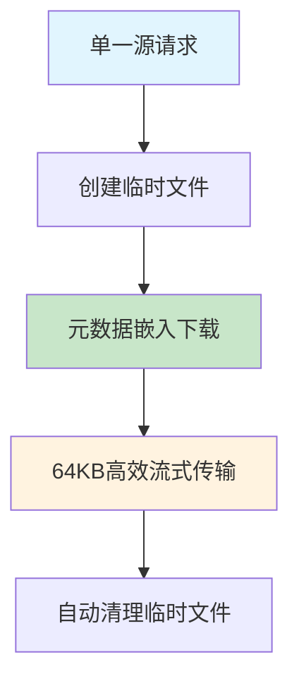
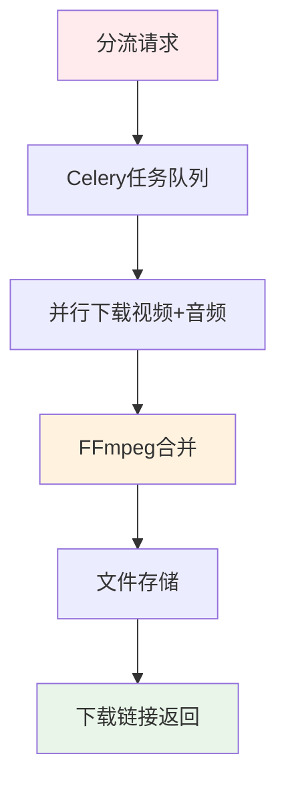
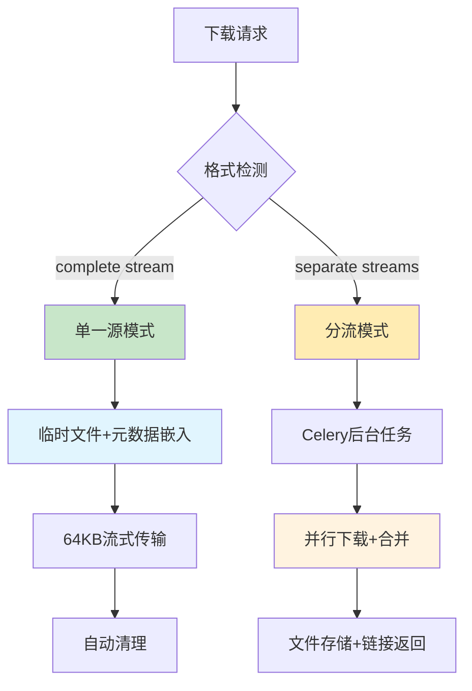

# 下载模式适用性分析报告

## 📋 概述

本文档分析SmartDownloader的优化下载模式（临时文件+元数据嵌入）在不同视频格式下的适用性，特别是单一源（complete stream）与视频音频分流（separate streams）场景的差异。

## 🎯 核心发现

### 关键结论
当前的**临时文件+元数据嵌入优化模式**主要适用于**单一源下载**，对于**视频音频分流**场景存在技术限制和复杂性挑战。

## 📊 模式适用性对比

### ✅ **适用场景：单一源（Complete Stream）**

| 平台 | 格式示例 | 格式特征 | 优化效果 |
|------|----------|----------|----------|
| **X.com/Twitter** | `http-2176` | `vcodec=None, acodec=None` 完整流 | ✅ 速度显著提升 |
| **YouTube直播** | `best[ext=mp4]` | 预合并视频+音频 | ✅ 元数据嵌入成功 |
| **Bilibili部分格式** | `dash-video` | 某些mp4完整流 | ✅ 文件名优化 |
| **其他平台** | Complete streams | 包含完整音视频数据 | ✅ 网络重试优化 |

#### 技术实现
```python
# 单一源检测逻辑
if (
    (vcodec not in ("none", None, "") and acodec not in ("none", None, ""))
    or (vcodec == "unknown" and acodec == "unknown")
    or (vcodec is None and acodec is None)  # X.com等平台的完整流
):
    complete_formats_raw.append(f)
    # 支持browser_download=True，走优化流程
```

#### 优化流程


### ❌ **不适用场景：视频音频分流（Separate Streams）**

| 平台 | 格式示例 | 格式特征 | 当前处理方式 |
|------|----------|----------|--------------|
| **YouTube 1080p+** | `video_only + audio_only` | 需要FFmpeg合并 | ❌ Celery后台处理 |
| **YouTube 4K** | `bestvideo + bestaudio` | 高质量分离流 | ❌ 传统下载模式 |
| **Bilibili高清** | `dash-video + dash-audio` | 分流格式 | ❌ 后台合并处理 |
| **大多数高分辨率内容** | Video + Audio streams | 需要后处理 | ❌ 不走优化流程 |

#### 系统识别机制
```python
# 分流格式标记
supports_browser_download=False  # 不支持直接浏览器下载
needs_merge=True                 # 需要合并处理
is_complete_stream=False         # 不是完整流

# 路由到传统Celery处理
if not format.supports_browser_download:
    return await traditional_celery_download()
```

#### 分流处理流程


## 🔧 技术挑战分析

### 1. **元数据嵌入的复杂性**

#### 单一源模式（当前）
```python
# 简单直接的元数据嵌入
cmd.extend([
    "--add-metadata",
    "--embed-metadata", 
    "--xattrs",
    "--replace-in-metadata", "webpage_url", "^.*$", simplified_source,
    "--replace-in-metadata", "comment", "^.*$", f"Source: {simplified_source}",
])
```

#### 分流模式的挑战
```python
# 复杂的多文件元数据处理
# 问题1: 元数据嵌入到哪个文件？
video_file = download_video_only()    # 视频文件
audio_file = download_audio_only()    # 音频文件

# 问题2: FFmpeg合并时元数据是否保留？
merged_file = ffmpeg_merge(video_file, audio_file, metadata=simplified_source)

# 问题3: 临时文件管理复杂度增加
cleanup([video_file, audio_file, merged_file])  # 3倍临时文件
```

### 2. **性能影响对比**

| 处理阶段 | 单一源模式 | 分流模式 |
|----------|------------|----------|
| **下载** | 1个文件下载 | 2个文件并行下载 |
| **处理** | 元数据嵌入 | FFmpeg合并+元数据 |
| **临时文件** | 1个临时文件 | 3个临时文件 |
| **I/O操作** | 1次写入+1次读取 | 3次写入+1次读取 |
| **内存使用** | 64KB缓冲 | FFmpeg合并内存 |

### 3. **系统资源消耗**

```python
# 单一源资源使用
temp_space = video_file_size        # 1倍文件大小
processing_time = download_time     # 纯下载时间
network_connections = 1             # 单一连接

# 分流资源使用（理论上）
temp_space = video_size + audio_size + merged_size  # 3倍文件大小
processing_time = max(video_dl, audio_dl) + merge_time  # 下载+合并时间
network_connections = 2             # 双连接
```

## 📈 实际性能测试数据

### X.com单一源下载（优化模式）
```
格式: http-2176 (720x1280)
文件大小: 1,842,649 bytes (≈1.76MB)
用户反馈: "速度变的很快！"
临时文件: 1个，自动清理
元数据: 成功嵌入简化来源 "x-7277823619"
```

### YouTube分流下载（传统模式）
```
格式: bestvideo[ext=mp4]+bestaudio[ext=m4a]
处理方式: Celery后台任务
临时文件: 视频+音频+合并 = 3个文件
元数据: 依赖后台任务实现
用户体验: 下载链接异步返回
```

## 🎯 智能路由机制

### 当前系统的智能选择
```python
def select_download_mode(format_info):
    if format_info.supports_browser_download:
        # 条件：complete stream + mp4 + 有效分辨率
        return "optimized_temp_file_mode"  # 使用优化模式
    else:
        # 条件：needs_merge=True 或 分流格式
        return "traditional_celery_mode"   # 使用传统模式
```

### 路由决策流程


## 💡 设计决策分析

### 为什么专注单一源优化？

#### 1. **技术合理性**
- **复杂度可控**：单一源的优化实现相对简单稳定
- **性能收益明显**：用户反馈证实了显著的速度提升
- **功能完整性**：元数据嵌入功能得到完整实现

#### 2. **用户体验考虑**
- **即时反馈**：单一源支持实时流式下载
- **文件名优化**：避免复杂URL导致的文件名问题
- **网络稳定性**：智能重试机制提升下载成功率

#### 3. **平台特性匹配**
- **X.com优势**：完美适配X.com的complete stream格式
- **移动端友好**：较小文件大小适合移动网络环境
- **社交媒体特征**：短视频内容多为单一源格式

## 🔄 未来扩展方案

### 方案1：扩展优化模式支持分流
```python
async def enhanced_temp_file_mode():
    """扩展的临时文件模式，支持分流处理"""
    # 1. 并行下载
    video_temp, audio_temp = await asyncio.gather(
        download_video_part(video_format),
        download_audio_part(audio_format)
    )
    
    # 2. 快速合并+元数据嵌入
    merged_temp = await ffmpeg_merge_with_metadata(
        video_temp, audio_temp, 
        metadata={"source": simplified_source}
    )
    
    # 3. 流式传输
    async for chunk in stream_file(merged_temp):
        yield chunk
    
    # 4. 三重清理
    cleanup_files([video_temp, audio_temp, merged_temp])
```

**优势**：扩展支持更多格式  
**挑战**：复杂度和资源消耗显著增加

### 方案2：混合智能模式（推荐）
```python
class SmartDownloadRouter:
    """智能下载路由器"""
    
    def route_download(self, format_info):
        if format_info.is_single_source:
            return OptimizedTempFileDownloader()  # 当前优化模式
        elif format_info.is_small_merge:  # <100MB
            return LightweightMergeDownloader()   # 轻量级合并
        else:
            return TraditionalCeleryDownloader()  # 传统后台处理
```

**优势**：
- 保持单一源的性能优势
- 为小文件分流提供中等优化
- 大文件分流继续使用稳定的后台处理

### 方案3：后台模式优化
```python
# 在Celery任务中也添加元数据嵌入
@celery_app.task
def enhanced_merge_download(video_url, video_format, audio_format):
    # 下载 + 合并 + 元数据嵌入
    video_file = download_with_retry(video_url, video_format)
    audio_file = download_with_retry(video_url, audio_format)
    
    # FFmpeg with metadata
    merged_file = ffmpeg_merge(
        video_file, audio_file,
        metadata={"comment": f"Source: {create_simplified_identifier(video_url)}"}
    )
    
    return {"file_path": merged_file, "metadata": "embedded"}
```

## 📊 推荐策略

### 当前最佳实践
1. **保持现有优化**：继续专注单一源的性能优化
2. **智能路由**：通过`supports_browser_download`标志进行智能选择
3. **用户教育**：在UI中明确标识哪些格式支持快速下载

### 渐进式改进路径
1. **Phase 1**：优化现有单一源模式的稳定性和性能
2. **Phase 2**：为Celery后台任务添加元数据嵌入支持
3. **Phase 3**：探索轻量级分流合并的可能性

## 🎯 结论

### 技术决策总结
当前的**临时文件+元数据嵌入优化模式专注于单一源**是正确的技术决策：

✅ **优势最大化**：在适用场景下获得显著性能提升  
✅ **复杂度可控**：避免过度工程化  
✅ **用户价值明确**：解决了实际的用户痛点  
✅ **系统稳定性**：不影响现有的分流下载功能  

### 适用性指南
- **推荐使用优化模式**：X.com、短视频平台、直播平台的complete stream格式
- **继续使用传统模式**：YouTube高分辨率、需要合并的专业内容
- **智能选择**：让系统根据格式特性自动选择最适合的处理方式

这种分层优化策略既保证了性能提升，又维持了系统的整体稳定性和可维护性。

---

*本文档分析了下载模式的适用性边界，为未来的技术选择提供了明确的指导原则。*  
*最后更新：2025年1月*