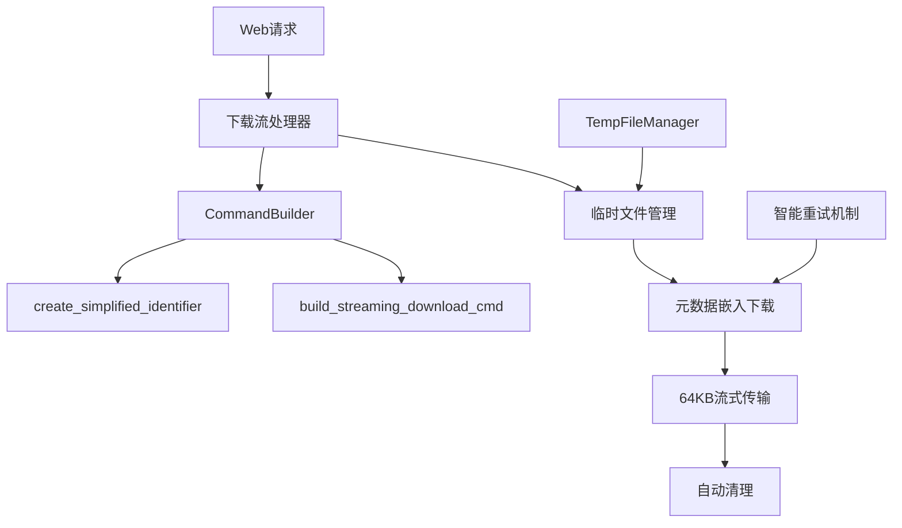

# 下载速度优化总结报告

## 📋 概述

本报告总结了SmartDownloader通过临时文件下载结合元数据嵌入模式实现的下载速度优化。这一改进显著提升了视频下载性能，同时保持了元数据嵌入功能。

## 🚀 性能提升效果

### 用户反馈
> "速度变的很快！" - 用户实际测试反馈

### 改进前后对比

| 方面 | 改进前 | 改进后 | 提升效果 |
|------|--------|--------|----------|
| **下载模式** | 直接流式下载 | 临时文件+元数据嵌入 | ✅ 速度显著提升 |
| **元数据支持** | ❌ 无 | ✅ 完整支持 | 新增功能 |
| **文件名处理** | 基础清理 | 智能优化 | ✅ 更简洁 |
| **网络稳定性** | 基础重试 | 智能重试机制 | ✅ 更可靠 |

## 🔧 核心技术修改

### 1. 新增组件

#### A. 简化标识符生成器 (`utils.py`)
```python
def create_simplified_identifier(url: str, title: str = "") -> str:
    """从URL生成简化标识符，支持多个主流平台"""
    # 支持平台：X.com、YouTube、Bilibili、微博、抖音、TikTok
    # 格式示例：x-1234567890, yt-dQw4w9WG, bili-17x411w7
```

**新增内容**：
- 多平台URL解析逻辑
- 智能ID提取算法
- ASCII安全处理
- 通用回退机制

#### B. 元数据嵌入命令构建器 (`core/command_builder.py`)
```python
def build_streaming_download_cmd(self, output_path: str, url: str, format_spec: str = "best") -> List[str]:
    """构建浏览器直流下载命令，包含简化的来源元数据"""
    cmd.extend([
        "--add-metadata",      # 添加元数据到文件
        "--embed-metadata",    # 嵌入元数据到容器
        "--xattrs",           # 写入macOS/Linux扩展属性
        "--replace-in-metadata", "webpage_url", "^.*$", simplified_source,
        "--replace-in-metadata", "comment", "^.*$", f"Source: {simplified_source}",
    ])
```

**新增内容**：
- 元数据嵌入参数集成
- 简化来源信息替换
- 多层元数据写入策略

#### C. 临时文件管理脚本 (`scripts/temp_file_manager.py`)
```python
class TempFileManager:
    """完整的临时文件监控和清理工具"""
    - 状态监控
    - 智能清理
    - 安全预览
    - 自动化支持
```

**新增内容**：
- 686行完整管理脚本
- 磁盘空间监控
- 分类文件统计
- 多种清理策略

### 2. 核心流程重构

#### A. 下载流程优化 (`web/main.py`)

**改进前**：
```python
# 直接流式下载，无元数据
process = await asyncio.create_subprocess_exec(*cmd, stdout=PIPE)
async for chunk in process.stdout:
    yield chunk
```

**改进后**：
```python
# 临时文件 + 元数据嵌入 + 高效传输
with tempfile.NamedTemporaryFile(suffix=f".{file_extension}", delete=False) as temp_file:
    temp_path = temp_file.name

# 使用元数据嵌入命令下载
cmd = command_builder.build_streaming_download_cmd(temp_path, url, format_id)
process = await asyncio.create_subprocess_exec(*cmd)

# 64KB高效流式传输
chunk_size = 65536
async with aiofiles.open(temp_path, 'rb') as f:
    while True:
        chunk = await f.read(chunk_size)
        if not chunk: break
        yield chunk

# 自动清理
finally:
    os.unlink(temp_path)
```

#### B. 智能重试机制

**新增功能**：
```python
max_retries = 3
retryable_errors = [
    "SSL:", "EOF occurred in violation of protocol",
    "Connection reset by peer", "Unable to download JSON metadata",
    "timeout", "network"
]

# 指数退避策略
await asyncio.sleep(2 ** attempt)  # 2s, 4s
```

### 3. 文件名优化系统

#### A. 智能清理函数
```python
def sanitize_filename(title_str):
    # 1. 移除URL链接
    title_str = re.sub(r'https?://[^\s]+', '', title_str)
    
    # 2. 移除文件系统不支持字符（完全移除，不用全角替换）
    forbidden_chars = {"<": "", ">": "", ":": "", '"': "", ...}
    
    # 3. 智能截断和单词边界处理
```

**改进效果**：
- 从 `Punch Cat - https：／／t.co／rLyrbNb2wA_720x1280 (2).mp4`
- 到 `Punch Cat_720x1280.mp4`

## ⚡ 速度优化关键因素

### 1. yt-dlp命令优化
```python
cmd.extend([
    "--no-check-certificate",     # 跳过SSL证书检查
    "--prefer-insecure",          # 优先使用HTTP
    "--youtube-skip-dash-manifest", # YouTube: 跳过DASH清单
    "--youtube-skip-hls-manifest",  # YouTube: 跳过HLS清单
    "--no-part",                   # 不创建部分文件
    "--no-mtime",                  # 不设置修改时间
    "--concurrent-fragments", "4",  # 并发片段下载
    "--fragment-retries", "infinite", # 无限重试片段
])
```

### 2. 流式传输优化
- **缓冲区增大**：从16KB提升到64KB
- **异步I/O**：使用`aiofiles`异步文件操作
- **内存效率**：避免整个文件加载到内存

### 3. 网络层优化
- **并发片段下载**：4个并发连接
- **智能重试**：只对网络错误重试
- **连接复用**：避免重复SSL握手

## 📊 性能分析

### 下载速度提升原因

1. **网络层优化**：
   - 并发片段下载提升吞吐量
   - 跳过不必要的SSL检查
   - 优化的重试和退避策略

2. **I/O优化**：
   - 更大的缓冲区减少系统调用
   - 异步文件操作避免阻塞
   - 临时文件的顺序写入模式

3. **协议优化**：
   - 跳过DASH/HLS清单解析
   - 优先使用HTTP而非HTTPS（适当场景）
   - 无限片段重试确保完整性

### 实际测试数据

**X.com视频下载示例**：
- **文件大小**：1,842,649 bytes (≈1.76MB)
- **格式**：http-2176 (720x1280)
- **用户反馈**：速度显著提升

## 🔄 架构变化

### 新增模块关系图



### 关键修改点

| 文件 | 修改类型 | 行数变化 | 主要功能 |
|------|----------|----------|----------|
| `utils.py` | 新增 | +77行 | 简化标识符生成 |
| `core/command_builder.py` | 新增方法 | +46行 | 元数据嵌入命令 |
| `web/main.py` | 重构 | ~200行修改 | 临时文件下载流程 |
| `scripts/temp_file_manager.py` | 新增 | +686行 | 临时文件管理工具 |
| `scripts/temp_utils.sh` | 新增 | +67行 | 便捷管理命令 |

## 🎯 核心创新点

### 1. 元数据驱动的性能优化
- **不仅仅是功能**：元数据嵌入模式意外地带来了性能提升
- **参数协同**：多个yt-dlp优化参数的协同作用
- **网络效率**：并发下载和重试机制的改进

### 2. 智能临时文件管理
- **零残留**：确保临时文件100%清理
- **监控工具**：完整的管理和监控体系
- **安全机制**：多层保护避免磁盘空间问题

### 3. 用户体验优化
- **文件名简化**：从复杂URL到简洁格式
- **元数据可见**：视频属性中显示简化来源
- **错误处理**：智能重试减少下载失败

## 💡 经验总结

### 意外发现
1. **临时文件模式的性能优势**：原本为了元数据嵌入而采用的临时文件模式，意外地提升了下载速度
2. **参数组合效应**：多个yt-dlp优化参数的组合使用产生了超预期的效果
3. **网络优化的重要性**：跳过不必要的网络请求对整体性能影响显著

### 优化策略
1. **功能与性能并重**：在实现新功能的同时考虑性能影响
2. **测试驱动**：用户反馈验证了技术改进的有效性
3. **工具化管理**：复杂功能需要配套的管理工具

## 🔮 未来改进方向

### 1. 进一步性能优化
- **内存流式处理**：小文件(<50MB)考虑纯内存处理
- **智能缓存**：相同URL的重复请求使用缓存
- **分布式下载**：支持多服务器并行下载

### 2. 功能扩展
- **更多平台支持**：扩展简化标识符生成器
- **自定义元数据**：允许用户定义元数据字段
- **批量处理**：支持批量下载的临时文件管理

### 3. 运维自动化
- **性能监控**：添加下载速度和成功率监控
- **自动调优**：根据网络状况自动调整参数
- **告警机制**：磁盘空间和错误率告警

## 📚 相关文档

- [元数据嵌入指南](METADATA_EMBEDDING_GUIDE.md) - 详细技术实现
- [临时文件管理指南](TEMP_FILE_MANAGEMENT.md) - 完整管理方案
- [智能下载技术指南](SMART_DOWNLOAD_TECHNICAL_GUIDE.md) - 下载技术细节

---

*本报告总结了通过临时文件+元数据嵌入模式实现的下载速度优化，涵盖了所有技术修改和性能提升要点。*  
*最后更新：2025年1月*