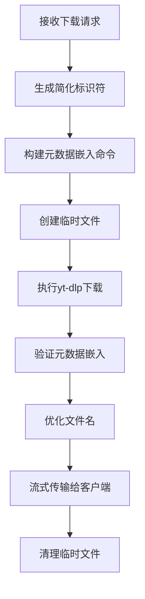

# 元数据嵌入与文件名优化指南

## 📋 概述

本文档详细说明SmartDownloader的元数据嵌入功能和文件名优化策略，解决了视频文件来源信息显示和浏览器下载文件名的问题。

## 🎯 功能目标

### 原始问题
- 视频下载后右键查看属性，"来源"字段显示很长的下载流URL
- 浏览器下载文件名包含复杂URL和特殊字符，导致文件名混乱
- 需要简化来源信息显示，便于用户识别视频来源

### 解决方案
- **元数据嵌入**：在视频文件中嵌入简化的来源标识符
- **文件名优化**：生成简洁、兼容的文件名格式
- **平台识别**：支持多个主流视频平台的智能识别

## 🔧 技术实现

### 1. 简化标识符生成

#### 核心函数：`create_simplified_identifier()`

```python
def create_simplified_identifier(url: str, title: str = "") -> str:
    """
    从URL生成简化标识符
    
    Args:
        url: 原始视频URL
        title: 视频标题（可选）
    
    Returns:
        简化标识符，格式如"x-1234567890"
    """
```

#### 支持的平台

| 平台 | URL模式 | 标识符格式 | 示例 |
|------|---------|------------|------|
| **X.com/Twitter** | `/status/(\d+)` | `x-{tweet_id后10位}` | `x-1234567890` |
| **YouTube** | `v=VIDEO_ID` | `yt-{video_id前8位}` | `yt-dQw4w9WG` |
| **Bilibili** | `/video/(BV\w+)` | `bili-{bv_id去前缀8位}` | `bili-17x411w7` |
| **微博** | `/(\d+)` | `wb-{id后8位}` | `wb-12345678` |
| **抖音** | `/video/(\d+)` | `dy-{id后8位}` | `dy-87654321` |
| **TikTok** | `/video/(\d+)` | `tt-{id后8位}` | `tt-98765432` |
| **通用回退** | 任意URL | `{domain前4位}-{path哈希6位}` | `exam-a1b2c3` |

### 2. 元数据嵌入机制

#### CommandBuilder集成

```python
def build_streaming_download_cmd(self, output_path: str, url: str, format_spec: str = "best") -> List[str]:
    # 生成简化标识符
    from utils import create_simplified_identifier
    simplified_source = create_simplified_identifier(url)
    
    cmd.extend([
        "--add-metadata",      # 添加元数据到文件
        "--embed-metadata",    # 嵌入元数据到容器
        "--xattrs",           # 写入macOS/Linux扩展属性
        # 设置关键元数据字段
        "--replace-in-metadata", "webpage_url", "^.*$", simplified_source,
        "--replace-in-metadata", "comment", "^.*$", f"Source: {simplified_source}",
    ])
```

#### 多层元数据策略

1. **yt-dlp webpage_url字段**：视频播放器识别的标准字段
2. **FFmpeg comment字段**：通用的注释字段，大多数播放器支持
3. **扩展属性(xattrs)**：macOS/Linux文件系统级别的元数据

### 3. 文件名优化

#### 清理策略

```python
def sanitize_filename(title_str):
    # 1. 移除URL链接
    title_str = re.sub(r'https?://[^\s]+', '', title_str)
    
    # 2. 移除文件系统不支持的字符
    forbidden_chars = {
        "<": "", ">": "", ":": "", '"': "",
        "/": "", "\\": "", "|": "", "?": "", "*": "",
    }
    
    # 3. 清理连续符号和多余空格
    title_str = re.sub(r'[-_\s]{2,}', ' ', title_str).strip()
    
    # 4. 长度限制和智能截断
    if len(title_str) > max_length:
        # 在单词边界截断
        # 在空格处截断以保持单词完整性
```

#### 文件名格式

- **视频文件**：`{清理后标题}_{分辨率}.mp4`
- **音频文件**：`{清理后标题}.{扩展名}`

#### ASCII兼容性

```python
def create_ascii_safe_filename(original_filename):
    # 提取ASCII字符和数字
    ascii_pattern = r"[a-zA-Z0-9\s\-_\(\)\[\]&+\.\,\!\?]+"
    ascii_parts = re.findall(ascii_pattern, name_part)
    
    # 回退到通用文件名
    if download_type == "video":
        fallback_name = f"video_{resolution}"
    else:
        fallback_name = "audio"
```

### 4. HTTP文件名头部处理

#### RFC 6266标准

```python
# 支持Unicode的Content-Disposition头
content_disposition = f"attachment; filename=\"{safe_filename}\"; filename*=UTF-8''{encoded_filename}"
```

- **filename**：ASCII兼容的备用文件名
- **filename***：UTF-8编码的完整文件名
- 浏览器会优先使用支持的格式

## 📊 实际效果

### 元数据嵌入效果

#### 处理前
```
来源: https://example.com/download-stream?url=https://x.com/user/status/1950437277823619214&format_id=http-2176&download_type=video&resolution=720x1280&title=Example+Video
```

#### 处理后
```
来源: x-7277823619
```

### 文件名优化效果

#### 处理前
```
Punch Cat - https：／／t.co／rLyrbNb2wA_720x1280 (2).mp4
```

#### 处理后
```
Punch Cat_720x1280.mp4
```

## 🔄 工作流程

### 下载流程



### 重试机制

```python
max_retries = 3
retryable_errors = [
    "SSL:",
    "EOF occurred in violation of protocol",
    "Connection reset by peer",
    "Unable to download JSON metadata",
    "timeout", "network",
]

# 指数退避：2s, 4s
await asyncio.sleep(2 ** attempt)
```

## 🧪 测试验证

### 标识符生成测试

```python
# tests/test_url_identifier.py
def test_twitter_url_extraction():
    url = "https://x.com/user/status/1950437277823619214"
    result = create_simplified_identifier(url)
    assert result == "x-7277823619"

def test_youtube_url_extraction():
    url = "https://www.youtube.com/watch?v=dQw4w9WgXcQ"
    result = create_simplified_identifier(url)
    assert result == "yt-dQw4w9WG"
```

### 文件名清理测试

```python
def test_filename_sanitization():
    title = "Video - https://t.co/example"
    result = sanitize_filename(title)
    assert result == "Video"
    assert "http" not in result
```

## 🚨 已知限制

### 1. 元数据兼容性
- **Windows Media Player**：可能不显示自定义元数据
- **某些移动播放器**：扩展属性支持有限
- **云存储服务**：上传时可能剥离元数据

### 2. 文件名限制
- **长度限制**：基于配置的最大长度
- **特殊字符**：某些Unicode字符在ASCII备用名中丢失
- **重复文件**：浏览器仍可能添加序号

### 3. 平台支持
- **新平台**：需要手动添加URL模式
- **URL格式变化**：平台更改URL结构时需要更新

## 🔧 配置选项

### 文件名配置

```python
# config.py
filename_max_length = 100           # 最大文件名长度
filename_truncate_suffix = "..."    # 截断后缀
```

### 元数据配置

```python
# 在CommandBuilder中可调整的元数据字段
metadata_fields = [
    ("webpage_url", simplified_source),
    ("comment", f"Source: {simplified_source}"),
    ("description", f"Downloaded from {simplified_source}"),
]
```

## 🔄 未来改进

### 1. 增强元数据支持
- 添加更多元数据字段（上传者、发布时间等）
- 支持缩略图嵌入
- 章节标记支持

### 2. 智能文件名生成
- AI标题清理和简化
- 多语言标题处理
- 自动去重文件名

### 3. 用户自定义
- 允许用户自定义标识符格式
- 可配置的文件名模板
- 平台特定的处理规则

## 📚 相关文档

- [临时文件管理](TEMP_FILE_MANAGEMENT.md) - 临时文件处理
- [配置指南](CONFIG.md) - 系统配置
- [技术指南](SMART_DOWNLOAD_TECHNICAL_GUIDE.md) - 下载技术

---

*最后更新：2025年1月*